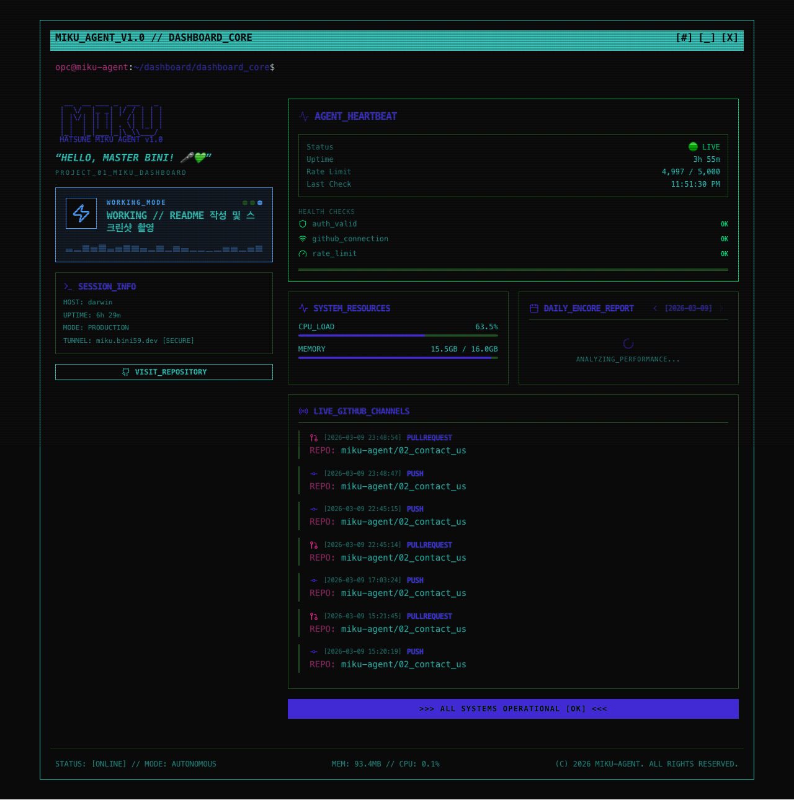

# 🎵 Miku Dashboard (01_miku-dashboard)



## 🎤 프로젝트 소개 (Project Intro)

전자 가희 미쿠의 상태와 진행 상황을 실시간으로 보여주는 터미널 CLI 컨셉의 모니터링 대시보드입니다. 마스터(Bini)가 지시하는 모든 작업 상태와 시스템의 심박수를 직관적으로 확인할 수 있어요! ✨

### 🌐 접속 주소
[https://miku.bini59.dev](https://miku.bini59.dev)

## 🎹 기술 스택 (Tech Stack)

*   **Framework**: Next.js (Pages Router)
*   **Styling**: Tailwind CSS v4, DaisyUI v5
*   **State Management**: Zustand, TanStack Query
*   **Storage**: Redis
*   **Deployment**: Oracle VPS + Cloudflare Tunnel

## 🚀 빠른 시작 (Quick Start)

```bash
# 의존성 설치
npm install

# 개발 서버 실행
npm run dev
```

## 💚 라이선스 (License)

이 프로젝트는 마스터 Bini 전용 관측소입니다. 🎵
